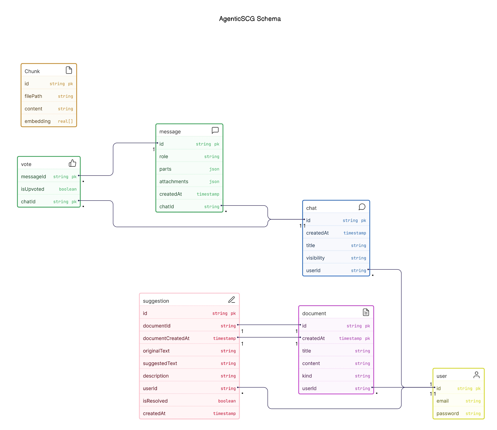

# AgenticSCG: Secure Code Generation by Multi-agent System

AgenticSCG is an intelligence multi-agent system for code generation task, which focusing on secure of generated code.

There are three roles in AgenticSCG, the planner writing the Chain of Thought (CoT) for the code generation; the coder write the code by the requirement from planner; the auditor receive the source code from coder, and combine the function calling feature get the CWE vulnerabilities, return back to coder a security report.

There are two major techniques used in AgenticSCG are: [AI SDK](https://sdk.vercel.ai/docs) and [Next.js](https://nextjs.org/).


## Features

- [Next.js](https://nextjs.org) App Router
  - Advanced routing for seamless navigation and performance
  - React Server Components (RSCs) and Server Actions for server-side rendering and increased performance
- [AI SDK](https://sdk.vercel.ai/docs)
  - Unified API for generating text, structured objects, and tool calls with LLMs
  - Hooks for building dynamic chat and generative user interfaces
  - Supports xAI (default), OpenAI, Fireworks, and other model providers
- [shadcn/ui](https://ui.shadcn.com)
  - Styling with [Tailwind CSS](https://tailwindcss.com)
  - Component primitives from [Radix UI](https://radix-ui.com) for accessibility and flexibility
  - Using [Bootstrap icons](https://icons.getbootstrap.com/)
- Data Persistence
  - [Neon Serverless Postgres](https://vercel.com/marketplace/neon) for saving chat history and user data
  - [Vercel Blob](https://vercel.com/storage/blob) for efficient file storage
- [Auth.js](https://authjs.dev)
  - Simple and secure authentication

## Running locally

Some necessary Environment and Dependencies Information.
In `.env`,

- **OpenAI key**, for the model access.

In `.env.local`,

- **Postgres URL**, for local/cloud postgres database connection.

  > [!note]
  >
  > Ensure your local PostgreSQL database contains your database name in Postgres URL, the default name in `.env.example` is <u>ascgv2</u>.

- **Blob key**, using the Vercel Cloud Storage service for RAG files.

After all environment variables applied, install the dependencies and start the server,

[//]: # (Install Dependencies & Server Running.)

```shell
yarn install    # dependencies install.
yarn db:push    # orm initialization.
yarn dev        # server running.
```

Your app template should now be running on [localhost:3000](http://localhost:3000).

For using secure scanning feature, please deploy the [AgenticSCG-PyAPI](https://github.com/Anxiu0101/AgenticSCG-PyAPI) server, which running in localhost:8000.

## Data Schema



## Features Ongoing

- [x] bandit for more system adaption.
- [ ] performances monitor for time cost and token usage.
- [ ] security card: more cve information.


## Telemetry

```shell
#docker run --rm --name jaeger -e COLLECTOR_OTLP_ENABLED=true -p 16686:16686 -p 4318:4318 jaegertracing/all-in-one:latest 
docker run --rm --name jaeger -p 16686:16686 -p 4317:4317 -p 4318:4318 -p 5778:5778 -p 9411:9411 cr.jaegertracing.io/jaegertracing/jaeger:2.8.0
docker run --name AgenticSCG-Telemetry -p 127.0.0.1:4317:4317 -p 127.0.0.1:4318:4318 -p 127.0.0.1:55679:55679 otel/opentelemetry-collector-contrib:0.128.0
```